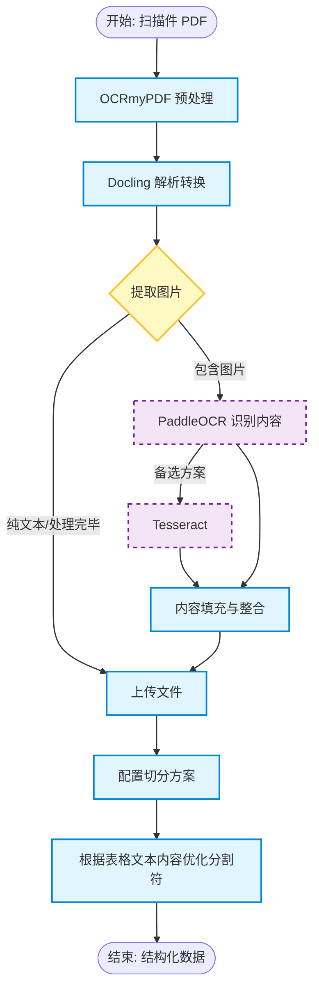
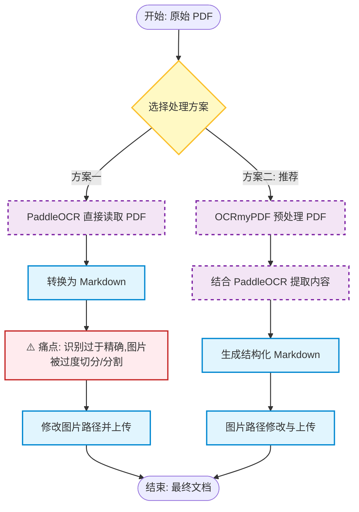

PaddlePaddle 是底层深度学习框架，PaddleOCR 是基于它专门做的 OCR 工具包，**PaddleX 是更高层的低代码全流程开发工具，它把 PaddleOCR（以及其他任务）封装成 pipeline**，并提供 CLI 和 Python API 供快速使用（安装 PaddleOCR 时会自动依赖 PaddleX 的 OCR 部分）。


# 一、PaddleX


![[Pasted image 20260604100955.png]]
https://paddlepaddle.github.io/PaddleX  
可以通过指定 `--use_hpip` 以使用高性能推理插件。示例如下：
paddlex --install hpi-cpu
paddlex --serve --pipeline image_classification --use_hpip`

==paddlex --pipeline PP-StructureV3 --input ace.pdf  --use_doc_orientation_classify false   --use_doc_unwarping false --save_path ./output_pp2

paddlex：
- `OCR` – 纯文字检测+识别，没有版面分析。
    
- `PP-StructureV3` – 您当前在用的，版面分析+表格识别+OCR。
    
- `table_recognition` / `table_recognition_v2` – 单独表格结构识别。
    
- `formula_recognition` – 公式识别。
    
- `seal_recognition` – 印章识别。
    
- `layout_parsing` – 版面区域分析。
    
- `doc_preprocessor` – 文档预处理（纠偏、去噪等）。
    
- `PaddleOCR-VL` / `PaddleOCR-VL-1.5` / `PaddleOCR-VL-1.6` – 多模态视觉语言模型，直接端到端输出结构化结果。
==
具体模型的参数：
https://ai.baidu.com/ai-doc/AISTUDIO/Kmfl2ycs0

|**产线名称**|**内部包含的核心能力**|**工业/商业适配场景**|
|---|---|---|
|**`image_classification`**|图像分类（如 MobileNet/ResNet 系列）|**工业分拣：** 自动判断流水线上的苹果是“好果”还是“坏果”；**电商打标：** 自动识别服装图片是“短袖”还是“外套”。|
|**`object_detection`**|目标检测（如 PP-YOLOE / RT-DETR）|**安防与质检：** 安全帽佩戴检测、传送带异物检测、缺陷检测（如钢板裂纹定位）。|
|**`instance_segmentation`**|实例分割（精确到像素轮廓边缘）|**医疗与自动驾驶：** 肿瘤边缘切片分割、路面行人和车辆的像素级轮廓抠图。|
|**`ts_forecast` / `ts_anomaly_det`**|时序预测 / 时序异常检测|**物联网与运维：** 服务器 CPU 负载异常预警、工厂设备传感器设备寿命预测、股票/气象走势预测。|
```bash
# 1. 退出当前虚拟环境
deactivate

# 2. 备份或删除旧的 .venv（可选）
mv .venv .venv_old

# 3. 重新创建虚拟环境（新版本 Python 会自动安装 pip）
python3 -m venv .venv

# 4. 激活并重新安装 paddleocr 和 paddlex
source .venv/bin/activate
pip install --upgrade pip
pip install paddleocr paddlex

# 5. 再安装 serving 插件
paddlex --install serving

# 6. 启动服务
paddlex --serve --pipeline OCR --device cpu
```
# 二、PaddleOCR

PaddleOCR
```bash
export PADDLE_PDX_ENABLE_MKLDNN_BYDEFAULT=0

paddleocr doc_parser -i ./f77226f8a4bdf3c4daba55f4d80f8529.jpg --pipeline_version v1.6 --save_path ./output_weixin_docparser_f77

paddleocr ocr -i image2.png --save_path ./weixin --use_angle_cls True


```


***==据以上OCR框架或工具的基础上制定如下方案：==***

- ## 扫描件方案

- **当前方案：**



- **后续方案**


- ## 图片

直接采用paddleocr提取图片内容


- ## doc    后续建议统一docx

转pdf --> opendataloader-pdf


- ## dwg

==场景：**批量处理文件夹内所有 DWG**==
**✅ Python + ezdxf 完整方案（Ubuntu 专用）**

这是目前在 Ubuntu 上**最实用、最稳定的方案**：使用 **ODA File Converter** 作为转换引擎 + `ezdxf` 读取。
