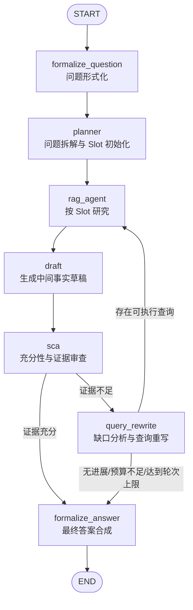

> 本文基于 RAGFlow 0.27+ 的 Agentic RAG 设计，重点说明如何使用 LangGraph 将复杂问答实现为一个可控、可迭代、可追溯的检索流程。  
> 本文不以逐行解释代码为目标，而是从系统设计、流程边界、工程落地和实际示例出发进行说明。

---

## 1. Agentic RAG 要解决什么问题？

传统 RAG 通常是：

```text
用户问题
  ↓
一次检索
  ↓
LLM 生成答案
```

这种方式适合简单事实查询，但面对以下问题时容易失败：

- **多跳问题；**
- **需要多个实体或属性的问题；**
- **比较、排序、最大值、最小值问题；**
- **需要枚举全部对象后再计算的问题；**
- **第一次检索只找到部分证据的问题；**
- **检索结果存在冲突的问题。**

例如：

> 2024 年某赛事中，哪位运动员获得的奖牌最少？请给出奖牌数量和依据。

这个问题至少需要：

1. 找到赛事中的参赛运动员；
2. 找到每位运动员的奖牌数量；
3. 确认统计范围；
4. 对所有候选进行比较；
5. 找出最小值；
6. 给出支持最终结论的证据。

因此，Agentic RAG 的核心思想是：

> **把一次性检索改造成一个有状态、可循环、可验证、带预算的研究流程**。

---

# 2. 总体架构

RAGFlow Agentic RAG 可以抽象为五个阶段：

```text
Question
   │
   ▼
Planner Agent
   │
   │  问题分解、扇出查询、建立 Slot Table
   ▼
RAG Agent / Search Fanout
   │
   │  并行检索、槽位研究、证据收集
   ▼
Sufficient Context Agent
   │
   │  判断证据是否足够，发现缺口
   ▼
Query Rewriter
   │
   │  针对缺口生成新查询
   └───────────────┐
                   │
                   ▼
              RAG Agent
                   │
                   ▼
             Sufficient Context Agent
                   │
                   ├── 足够
                   ▼
          Final Synthesis Agent
                   │
                   ▼
                Answer
```

完整流程可以表示为：



---


## 技术亮点概览表


| 技术亮点                    | 核心说明                                                          | 业务价值                          |
| ----------------------- | ------------------------------------------------------------- | ----------------------------- |
| ** LangGraph 状态编排**     | 使用 `StateGraph` 管理问题、Slot、证据池、草稿和评审结果，并支持条件路由与循环              | 将 RAG 从单次调用升级为可控的 Agent 工作流   |
| ** Planner 问题分解**       | 将复杂问题拆分为多个可检索的 fan-out 子问题                                    | 提升多跳、比较和复杂事实问题的召回完整性          |
| ==**Slot Table 事实驱动**== | ==为每个待解决事实维护线索、候选答案、置信度和证据==                                  | ==明确记录“已解决什么、还缺什么”，避免整题盲目搜索== |
| **多通道检索**               | 结合 BM25 精确检索、Hybrid 语义检索和结构化 Evidence Row                     | 同时覆盖专有名词、数字、同义表达和结构化事实        |
| ==**SCA 充分性审查**==       | ==审查原问题、中间草稿、Claim 和证据，判断是否可以形成合理答案==                         | ==降低过早回答和证据不足导致的幻觉==          |
| **缺口驱动迭代**              | SCA 输出 `missing_fact` 和 `search_hint`，Query Rewriter 针对缺口继续检索 | 从“重复搜索”转向“定向补齐信息”             |
| ** 证据绑定与可追溯引用**         | 将 Slot、候选答案和 `evidence_ids` 绑定，并传递到最终合成阶段                     | 支持答案验证、引用追踪和问题定位              |
| ==** 预算与降级控制**==        | ==通过超时、最大轮数、无进展检测和 Low/Medium/High/Ultra 模式控制成本==             | ==在准确率、延迟和资源消耗之间取得平衡==        |


*细节可下方*


---

# 3. LangGraph 在系统中的职责

LangGraph 负责的是**流程编排**，不是具体的检索算法或答案判断逻辑。

## 3.1 `StateGraph`：定义有状态流程

```python
graph = StateGraph(AgenticState)
```

`AgenticState` 是整个流程的共享状态，主要包含：

```python
class AgenticState(TypedDict, total=False):
    messages: list
    question: str
    plan: dict
    current_queries: list

    slot_table: object
    unresolved_slots: list
    slot_evidence: dict

    kbinfos: dict
    draft: str
    rag_answer: str

    sca: dict
    verdict: dict

    search_rounds: int
    attempted: list
    deadline: float
    no_progress: bool
```

这些字段分别表示：

| 字段 | 作用 |
|---|---|
| `question` | 规范化后的用户问题 |
| `plan` | Planner 产生的 fan-out 查询 |
| `slot_table` | 当前待解决事实槽位 |
| `unresolved_slots` | 尚未解决的槽位 |
| `kbinfos` | 累计证据池 |
| `slot_evidence` | 槽位与证据之间的映射 |
| `draft` | 中间研究草稿 |
| `sca` | SCA 的完整审查结果 |
| `verdict` | 当前是否充分 |
| `search_rounds` | 已完成的补充检索轮次 |
| `deadline` | 全局截止时间 |
| `no_progress` | 最近一轮是否没有产生有效进展 |

---

## 3.2 `add_node`：注册处理阶段

```python
graph.add_node("formalize_question", formalize_question)
graph.add_node("planner", planner)
graph.add_node("rag_agent", rag_agent)
graph.add_node("draft", draft)
graph.add_node("sca", sca)
graph.add_node("query_rewrite", query_rewrite)
graph.add_node("formalize_answer", formalize_answer)
```

每个节点只负责一个明确阶段：

| 节点 | 主要职责 |
|---|---|
| `formalize_question` | 从对话中提取最终问题 |
| `planner` | 分解问题并建立槽表 |
| `rag_agent` | 针对未解决槽位执行研究 |
| `draft` | 生成保留事实的中间草稿 |
| `sca` | 审查证据是否充分 |
| `query_rewrite` | 根据缺口生成下一轮查询 |
| `formalize_answer` | 生成最终答案 |

---

## 3.3 `add_edge`：连接固定流程

```python
graph.add_edge(START, "formalize_question")
graph.add_edge("rag_agent", "draft")
graph.add_edge("draft", "sca")
graph.add_edge("formalize_answer", END)
```

固定边适合表达确定顺序，例如：

```text
rag_agent → draft → sca
```

---

## 3.4 `add_conditional_edges`：根据状态动态路由

SCA 之后的流程不是固定的：

```python
graph.add_conditional_edges(
    "sca",
    route_after_sca,
    {
        "query_rewrite": "query_rewrite",
        "formalize_answer": "formalize_answer",
    },
)
```

路由函数需要综合判断：

```python
def route_after_sca(state):
    if state.get("no_progress"):
        return "formalize_answer"

    if state["verdict"]["status"] == "SUFFICIENT":
        return "formalize_answer"

    if state["search_rounds"] >= MAX_ROUNDS:
        return "formalize_answer"

    if remaining_time(state) <= MIN_HEADROOM:
        return "formalize_answer"

    return "query_rewrite"
```

因此，SCA 的“不足”并不一定意味着无限重搜。只有同时满足以下条件时才继续：

1. SCA 判断证据不足；
2. 仍然存在具体可执行的缺口；
3. 尚未达到最大轮数；
4. 仍有足够时间；
5. 最近一轮确实产生了新的证据或新的方向。

---

## 3.5 `compile()` 和 `ainvoke()`

图构建完成后：

```python
graph = graph_builder.compile()
```

执行时：

```python
result = await graph.ainvoke(
    initial_state,
    {
        "recursion_limit": 60,
    },
)
```

这里需要区分两个概念：

| 限制 | 作用 |
|---|---|
| `recursion_limit` | 限制 LangGraph 的执行步数 |
| `TOTAL_BUDGET` | 限制一次问题的总耗时 |
| `MAX_ROUNDS` | 限制补充检索轮数 |
| `NODE_TIMEOUT` | 限制单个节点耗时 |

工程上不能只依赖 `recursion_limit`。复杂 Agent 流程必须同时具备时间预算、轮次预算和无进展退出机制。

---

# 4. 思考模式与流程边界

RAGFlow 通常按照 thinking mode 提供不同复杂度的流程。

## 4.1 Low：快速路径


特点：

- 不做问题分解；
- 不建立复杂槽表；
- 不执行 SCA 迭代；
- 适合简单事实查询；
- 延迟和成本最低。

典型问题：

```text
什么是 RAG？
```

---

## 4.2 Medium：单轮 Agentic RAG

```text
formalize_question
  → rag_agent
  → draft
  → sca
  → formalize_answer
```

特点：

- 使用 Agentic RAG；
- 可以使用槽位研究；
- SCA 可以提供审查信息；
- 通常不持续驱动多轮重检索；
- 适合中等复杂度问题。

---

## 4.3 High：带规划和迭代

```text
formalize_question
  → planner
  → rag_agent
  → draft
  → sca
  → query_rewrite
  → rag_agent
  → ...
  → final_answer
```

特点：

- 先进行 fan-out 分解；
- 对多个问题方面进行研究；
- SCA 可以驱动下一轮检索；
- 通常设置 3 轮左右的补充研究上限。

---

## 4.4 Ultra：更深研究

Ultra 模式一般与 High 流程相同，但拥有：

- 更高的 SCA 轮数；
- 更长的研究预算；
- 更复杂的关系探索能力；
- 更高的延迟和模型调用成本。

实际部署时不建议默认所有问题都使用 Ultra。更合理的策略是：

```text
简单问题 → Low
中等问题 → Medium
多跳/比较问题 → High
高价值、强完整性要求的问题 → Ultra
```

---

# 5. Slot Table：复杂问题的事实状态表

## 5.1 Slot 是什么？

Slot 不是普通查询字符串，而是一个需要被确认的事实变量。

```python
@dataclass
class Variable:
    id: int
    type: str
    question_clues: list
    discovered_clues: list
    candidate: str | None
    candidate_strength: float | None

    def filled(self) -> bool:
        return bool(self.candidate)
```

例如问题：

> 2024 年某赛事中，哪位运动员获得的奖牌最少？

系统可能建立：

```text
slot 0:
  type: entity
  clue: 参赛运动员有哪些

slot 1:
  type: attribute
  clue: 每位运动员获得多少枚奖牌

slot 2:
  type: aggregate
  clue: 哪位运动员的奖牌数量最少
```

Slot 的状态可能从：

```text
EMPTY
```

变成：

```text
candidate = "运动员 B"
candidate_strength = 0.91
```

---

## 5.2 为什么需要 Slot？

如果只维护查询：

```text
["参赛运动员", "奖牌数量", "最少奖牌"]
```

系统无法清晰表示：

- 哪个事实已经找到；
- 哪个事实仍然缺失；
- 某个候选答案由什么证据支持；
- 下一轮只需要搜索哪一个部分。

Slot Table 解决的是：

```text
事实需求
+ 当前候选
+ 置信度
+ 证据关系
+ 未解决状态
```

---

## 5.3 Slot 的工程边界

Slot 设计时需要限制：

```text
最大 Slot 数量：例如 8
最大树深：例如 3
每轮最多研究的 Slot：例如 3
每个 Slot 的最大线索数：例如 4
```

这些限制用于避免：

- 问题无限分解；
- Slot 数量爆炸；
- 每轮启动过多 Agent Session；
- 单个复杂问题消耗过多模型调用。

---

# 6. 一个完整示例：极值问题

## 6.1 用户问题

```text
2024 年某赛事中，哪位运动员获得的奖牌最少？请说明奖牌数量和依据。
```

这是一个典型的：

```text
枚举 + 比较 + 极值选择
```

问题。

---

## 6.2 Planner 分解

Planner 不应该直接回答，而是生成可检索的子问题：

```json
{
  "fanouts": [
    "2024 年某赛事参赛运动员",
    "2024 年某赛事各运动员奖牌数量",
    "2024 年某赛事奖牌数量比较"
  ]
}
```

错误做法：

```json
{
  "fanouts": [
    "运动员 B 获得最少奖牌"
  ]
}
```

这是错误的，因为 Planner 把未经检索验证的结论写进了查询，可能导致检索和后续 Slot 被错误事实污染。

---

## 6.3 Slot 初始化

```text
slot 0:
  type: entity
  question_clues:
    - 2024 年某赛事参赛运动员

slot 1:
  type: attribute
  question_clues:
    - 每位运动员的奖牌数量

slot 2:
  type: aggregate
  question_clues:
    - 比较所有运动员的奖牌数量并找出最少者
```

初始状态：

```text
d0(...)
```

其中：

- `.` 表示未解决；
- `+` 表示已解决；
- `d0` 表示当前研究深度为 0。

---

## 6.4 第一轮研究

RAG Agent 针对 Slot 并行执行研究。

检索结果：

```text
Chunk 1:
运动员 A 获得 3 枚奖牌。

Chunk 2:
运动员 B 获得 1 枚奖牌。

Chunk 3:
运动员 C 获得 5 枚奖牌。
```

Slot 更新：

```text
slot 0:
  candidate = "A、B、C"
  strength = 0.89

slot 1:
  candidate = "A=3，B=1，C=5"
  strength = 0.94

slot 2:
  candidate = "B"
  strength = 0.86
```

证据绑定：

```python
slot_evidence = {
    "1": {
        "evidence_ids": ["chunk-1", "chunk-2", "chunk-3"],
        "candidate": "A=3，B=1，C=5"
    },
    "2": {
        "evidence_ids": ["chunk-1", "chunk-2", "chunk-3"],
        "candidate": "B"
    }
}
```

---

## 6.5 SCA 审查

SCA 需要检查：

1. 是否完整列出了候选运动员；
2. 每位运动员的奖牌数量是否都有证据；
3. 是否使用了同一统计范围；
4. 是否真的比较了所有候选；
5. `1` 是否是最小值；
6. 运动员 B 是否由对应证据支持。

如果证据完整：

```json
{
  "is_sufficient": true,
  "confidence": 0.93,
  "sub_queries": [
    {
      "sub_query": "2024 年某赛事参赛运动员",
      "satisfied": true
    },
    {
      "sub_query": "每位运动员的奖牌数量",
      "satisfied": true
    },
    {
      "sub_query": "哪位运动员的奖牌数量最少",
      "satisfied": true
    }
  ]
}
```

随后进入最终合成。

---

## 6.6 证据不完整的情况

如果只有：

```text
A = 3 枚
B = 1 枚
```

但没有 C 的数据，SCA 应该返回：

```json
{
  "is_sufficient": false,
  "confidence": 0.88,
  "sub_queries": [
    {
      "sub_query": "C 的奖牌数量",
      "satisfied": false,
      "missing_fact": "C 在该赛事中的奖牌数量",
      "search_hint": "C 2024 年某赛事 奖牌数量"
    }
  ],
  "claims": {
    "slot-2": {
      "grounded": false,
      "missing_information": [
        {
          "what": "缺少完整候选集合，无法确认 B 是最少者",
          "search_hint": "2024 年某赛事所有运动员奖牌数量"
        }
      ]
    }
  }
}
```

注意：

```text
B 目前是已知候选
```

不等于：

```text
B 已经被证明是全体中最少者
```

这正是 SCA 必须检查的地方。

---

# 7. 检索层：精确检索和语义检索并行

Agentic RAG 通常不应该只依赖一种检索方式。

## 7.1 Channel A：BM25 精确召回

适合：

- 人名；
- 地名；
- 产品名；
- 年份；
- 数字；
- 文档标题；
- 专业术语。

典型流程：

```text
查询
  ↓
提取关键词
  ↓
BM25 召回候选
  ↓
narrow_by_terms 窄化
  ↓
保留高价值片段
```

例如：

```text
查询：Paris population 2019
关键词：Paris、population、2019
```

BM25 更容易找到包含精确实体名和数值的文档。

---

## 7.2 Channel B：Hybrid / Vector 语义召回

适合：

- 同义表达；
- 语序变化；
- 文档没有复用原查询词；
- 查询与原文表达差异较大的情况。

例如查询：

```text
Paris population in 2019
```

原文可能写成：

```text
The French capital had approximately 2.16 million residents in 2019.
```

这段文本未必包含完整的 `population` 表达，但语义上高度相关。

因此，语义通道通常不应再被过于严格的关键词窄化过滤掉。

---

## 7.3 Evidence Row：结构化证据快速通道

如果数据集已完成知识编译，可以优先使用结构化证据行：

```text
[evidence] Paris 2019 Census
Evidence (verbatim): "Paris had 2.161 million inhabitants..."
```

Evidence Row 通常包含：

- 原子事实；
- 事实名称；
- 原文引用；
- 来源文档；
- 来源 chunk ID。

它的优势是：

- 事实密度高；
- 更容易被 SCA 审查；
- 可以直接预填充 Slot；
- 可追溯到原始 chunk。

---

# 8. 证据池和 SCA 评审视图分离

系统应区分：

```text
Evidence Pool：用于存储累计检索结果
Review View：每次只给 SCA 看精选证据
```

推荐的策略是：

```text
证据池：最多 60 个 chunk
Raw passage：设置单独配额，例如 30 个
Evidence Row：优先保留，例如最多 24 个
SCA Review View：最多 60 个
```

实际部署时应以当前版本源码的常量为准，不要在文档中将历史版本的池大小写死。

---

## 8.1 Review View 的排序因素

可以综合：

```text
最终得分 =
    检索相关度 × 0.45
  + 查询词覆盖率 × 0.45
  + 新鲜度奖励
```

同时：

1. Evidence Row 优先；
2. 与当前缺口相关的新证据优先；
3. 证据 ID 去重；
4. 对极值问题保留完整候选集合；
5. 对表格数据避免只截取开头。

---

## 8.2 为什么不能把所有 chunk 都传给 SCA？

因为会导致：

- Prompt 过长；
- 关键证据被淹没；
- LLM 审查质量下降；
- 延迟和成本增加；
- 后续轮次不断累积上下文。

因此，存储池和审查上下文必须解耦。

---

# 9. SCA 的实际判断标准

SCA 不只是判断“是否有相关文档”，而是回答：

> 只使用当前证据，一个认真阅读这些内容的人，能否给出原问题要求的合理答案？

它至少需要完成三步。

## 第一步：列出完成问题所需的子问题

例如：

```text
1. 赛事中有哪些运动员？
2. 每位运动员获得了多少奖牌？
3. 统计口径是否一致？
4. 哪个奖牌数量最小？
5. 最终结果是否有对应证据？
```

## 第二步：逐项核对证据

```text
运动员列表：已覆盖
A 的数量：已覆盖
B 的数量：已覆盖
C 的数量：缺失
极值比较：无法可靠完成
```

## 第三步：输出结论和缺口

```json
{
  "is_sufficient": false,
  "missing_information": [
    {
      "what": "C 的奖牌数量",
      "search_hint": "C 某赛事 奖牌数量"
    }
  ]
}
```

---

# 10. Query Rewriter：只搜索缺失部分

当 SCA 发现缺口时，Query Rewriter 不应该简单重复原始问题，而应结合：

- SCA 的缺口；
- 已经尝试过的查询；
- 查询返回的新证据数量；
- 当前证据池内容；
- 未解决 Slot 的线索。

例如历史记录：

```text
已搜索：
- 2024 某赛事参赛运动员：新增 8 个片段
- 某赛事奖牌数量：新增 4 个片段
- 运动员 B 奖牌数：无新增片段
```

当前缺口：

```text
缺少运动员 C 的奖牌数量
```

下一轮应该生成：

```text
运动员 C 2024 某赛事 奖牌数量
```

而不是再次生成：

```text
2024 年某赛事奖牌最少的运动员
```

---

## 10.1 Gap Promotion：把缺口升级为新 Slot

如果某个缺口需要独立研究，可以将其提升为新 Slot：

```text
原始缺口：
  缺少每位运动员的完整奖牌记录

新增 Slot：
  type: attribute
  clues:
    - 每位运动员的完整奖牌记录
    - 2024 年某赛事所有运动员奖牌数量
```

但必须设置边界：

```text
最大 Slot 数量：8
最大深度：3
同一问题只创建一次
```

否则可能出现：

```text
SCA 发现缺口
  → 创建新 Slot
  → 新 Slot 再产生缺口
  → 无限创建 Slot
```

---

# 11. 槽位合并必须保证确定性

多个 Action Session 可能并发执行，返回顺序不稳定。

错误做法：

```python
# 谁最后返回就覆盖谁
slot.candidate = branch.candidate
```

这会导致：

```text
同一个问题
同样的检索结果
不同的并发完成顺序
不同的最终答案
```

更稳妥的做法是比较候选强度：

```python
if branch_strength > current_strength:
    adopt(branch_candidate)
else:
    keep(current_candidate)
```

注意：`candidate_strength` 是模型或执行器提供的支持强度，不应被误认为严格统计概率。它适合用于候选排序，但最终仍必须经过 SCA 和证据检查。

---

# 12. 预算、超时和停止条件

Agentic RAG 最容易出现的问题是：

```text
检索 → 发现缺口 → 再检索 → 继续发现缺口 → 无限循环
```

因此必须设计多层边界。

## 12.1 全局预算

例如：

```python
TOTAL_BUDGET_S = 180
```

表示一次问题的研究流程最多使用约 180 秒。

## 12.2 节点超时

不同节点设置独立上限：

```text
slot research：120 秒
prefetch：90 秒
draft：60 秒
SCA：60 秒
query rewrite：45 秒
```

## 12.3 最小余量

如果剩余时间不足以完成完整研究轮次：

```python
remaining_time < MIN_ROUND_HEADROOM
```

则不再启动新的检索轮，直接进入最终答案合成。

## 12.4 最大轮数

例如：

```text
High：最多 3 轮
Ultra：最多 5 轮
```

## 12.5 无进展检测

如果出现以下情况，应停止：

- 新查询没有返回新 chunk；
- SCA review view 的 ID 未变化；
- 证据池已经达到上限；
- Query Rewriter 没有产生可执行查询；
- 所有新查询都是重复查询；
- 未解决 Slot 数量没有变化。

---

# 13. 失败和降级策略

一个可落地的 Agentic RAG 不能假设每一步都成功。

## 13.1 Planner 失败

如果 Planner 没有返回合法 JSON：

```text
降级为原始问题查询
```

或者使用 fan-out 作为 fallback：

```text
每个 fan-out 转换为一个 aspect slot
```

## 13.2 Slot 初始化失败

如果 Slot 分解失败：

```text
使用 fan-out 创建最多 4 个 aspect slot
```

如果没有 fan-out：

```text
创建一个 answer slot，目标就是原始问题
```

## 13.3 SCA 超时或返回异常

不要直接把异常当成“证据充分”。

合理处理方式：

```text
SCA 无法判断
  → 尝试使用 unresolved_slots 产生下一轮查询
  → 若无可执行缺口，则停止并生成部分答案
```

## 13.4 Query Rewriter 没有生成查询

如果没有新查询：

```text
no_progress = True
→ 进入最终答案
```

最终答案应明确说明：

- 哪些事实已经找到；
- 哪些信息仍缺失；
- 结论是否为部分结论。

## 13.5 检索池为空

如果没有证据：

```text
不要使用通用知识补全
```

应输出配置的空结果或明确说明证据不足。

## 13.6 证据冲突

如果两个 chunk 给出不同数值：

```text
不要简单选择相似度更高的一个
```

应由 SCA 标记：

```json
{
  "contradictions": [
    "来源 A 给出 3 枚奖牌，来源 B 给出 4 枚奖牌"
  ]
}
```

后续可以：

1. 搜索更权威来源；
2. 加入时间范围；
3. 比较统计口径；
4. 最终答案中明确说明冲突。

---

# 14. 最终答案合成的边界

最终答案模型不应该重新进行开放式研究，它的职责是：

```text
根据已经审查过的草稿和证据生成可读答案
```

最终合成时应遵循：

1. 只使用证据池和已批准的中间草稿；
2. 不使用外部常识补齐缺口；
3. 对未解决 Slot 明确说明；
4. 对极值问题比较所有候选；
5. 保留数字、日期、实体名称；
6. 输出对应引用；
7. 如果研究不足，生成 partial answer，而不是伪装成完整答案。

特别是极值问题，需要防止：

```text
第一个出现的实体
```

被误认为：

```text
最小值/最大值实体
```

必须要求最终模型重新比较证据中的候选。

---

# 15. 推荐的生产级状态结构

可以将状态设计为：

```python
class AgenticState(TypedDict, total=False):
    # 输入
    messages: list
    question: str

    # 规划
    plan: dict
    current_queries: list[str]

    # Slot 研究
    slot_table: object
    unresolved_slots: list[dict]
    slot_evidence: dict

    # 检索和草稿
    kbinfos: dict
    draft: str
    rag_answer: str

    # 评审
    sca: dict
    verdict: dict

    # 控制
    search_rounds: int
    attempted: list[dict]
    deadline: float
    no_progress: bool

    # 输出控制
    partial_answer: bool
    abstain: bool
    empty_result: bool
```

生产环境还可以加入：

```python
trace_id: str
request_id: str
tenant_id: str
model_usage: dict
retrieval_latency: dict
node_errors: list
```

用于监控和问题排查。

---

# 16. 一个可落地的简化实现

下面是一个抽象版 LangGraph Agentic RAG：

```python name=agentic_rag_workflow.py
from typing import TypedDict

from langgraph.graph import START, END, StateGraph


class AgenticState(TypedDict, total=False):
    question: str
    queries: list[str]
    chunks: list[dict]
    slot_table: list[dict]
    unresolved_slots: list[dict]
    draft: str
    sca: dict
    verdict: dict
    search_rounds: int
    no_progress: bool
    answer: str


MAX_ROUNDS = 3


async def formalize_question(state: AgenticState) -> dict:
    question = state["question"].strip()

    return {
        "question": question,
        "queries": [],
        "chunks": [],
        "slot_table": [],
        "unresolved_slots": [],
        "search_rounds": 0,
        "no_progress": False,
    }


async def planner(state: AgenticState) -> dict:
    question = state["question"]

    # 实际实现中由 Planner LLM 产生。
    queries = [
        f"{question} 涉及的实体",
        f"{question} 所需的属性和数值",
        f"{question} 的比较或计算结果",
    ]

    slots = [
        {
            "id": 0,
            "type": "entity",
            "clues": [queries[0]],
            "candidate": None,
        },
        {
            "id": 1,
            "type": "attribute",
            "clues": [queries[1]],
            "candidate": None,
        },
        {
            "id": 2,
            "type": "aggregate",
            "clues": [queries[2]],
            "candidate": None,
        },
    ]

    return {
        "queries": queries,
        "slot_table": slots,
        "unresolved_slots": slots,
    }


async def rag_agent(state: AgenticState) -> dict:
    queries = state.get("queries", [])

    # 实际实现中这里调用 BM25、Hybrid Search 和 Action Session。
    new_chunks = [
        {
            "chunk_id": f"chunk-{state.get('search_rounds', 0)}-{i}",
            "content": f"Retrieved evidence for: {query}",
        }
        for i, query in enumerate(queries)
    ]

    old_chunks = state.get("chunks", [])
    old_ids = {c["chunk_id"] for c in old_chunks}

    merged = old_chunks + [
        c for c in new_chunks
        if c["chunk_id"] not in old_ids
    ]

    # 示例：假设本轮解决了所有 Slot。
    slots = []
    for slot in state.get("slot_table", []):
        updated = dict(slot)
        updated["candidate"] = f"candidate-for-slot-{slot['id']}"
        updated["candidate_strength"] = 0.85
        slots.append(updated)

    return {
        "chunks": merged,
        "slot_table": slots,
        "unresolved_slots": [
            s for s in slots
            if not s.get("candidate")
        ],
        "search_rounds": state.get("search_rounds", 0) + 1,
    }


async def draft(state: AgenticState) -> dict:
    slots = state.get("slot_table", [])

    draft_text = "\n".join(
        f"Slot {slot['id']}: {slot.get('candidate', 'NOT RESOLVED')}"
        for slot in slots
    )

    return {"draft": draft_text}


async def sca(state: AgenticState) -> dict:
    unresolved = state.get("unresolved_slots", [])
    chunks = state.get("chunks", [])

    sufficient = bool(chunks) and not unresolved

    return {
        "sca": {
            "is_sufficient": sufficient,
            "missing_information": [
                slot.get("clues", ["unknown"])[0]
                for slot in unresolved
            ],
        },
        "verdict": {
            "status": "SUFFICIENT" if sufficient else "INSUFFICIENT"
        },
    }


async def query_rewrite(state: AgenticState) -> dict:
    missing = state.get("sca", {}).get("missing_information", [])

    if not missing:
        return {"no_progress": True}

    queries = [
        f"补充查找：{item}"
        for item in missing
    ]

    return {
        "queries": queries,
        "no_progress": False,
    }


async def final_answer(state: AgenticState) -> dict:
    chunks = state.get("chunks", [])
    draft_text = state.get("draft", "")
    verdict = state.get("verdict", {})

    if verdict.get("status") == "SUFFICIENT":
        answer = (
            "基于已验证证据生成答案：\n"
            f"{draft_text}\n\n"
            "证据：\n"
            + "\n".join(c["content"] for c in chunks)
        )
    else:
        answer = (
            "当前只能给出部分结论。已获得的信息如下：\n"
            f"{draft_text}\n\n"
            "仍缺少："
            f"{state.get('sca', {}).get('missing_information', [])}"
        )

    return {"answer": answer}


def route_after_sca(state: AgenticState) -> str:
    if state.get("no_progress"):
        return "final_answer"

    if state.get("verdict", {}).get("status") == "SUFFICIENT":
        return "final_answer"

    if state.get("search_rounds", 0) >= MAX_ROUNDS:
        return "final_answer"

    return "query_rewrite"


def route_after_rewrite(state: AgenticState) -> str:
    if state.get("no_progress"):
        return "final_answer"

    if not state.get("queries"):
        return "final_answer"

    return "rag_agent"


builder = StateGraph(AgenticState)

builder.add_node("formalize_question", formalize_question)
builder.add_node("planner", planner)
builder.add_node("rag_agent", rag_agent)
builder.add_node("draft", draft)
builder.add_node("sca", sca)
builder.add_node("query_rewrite", query_rewrite)
builder.add_node("final_answer", final_answer)

builder.add_edge(START, "formalize_question")
builder.add_edge("formalize_question", "planner")
builder.add_edge("planner", "rag_agent")
builder.add_edge("rag_agent", "draft")
builder.add_edge("draft", "sca")

builder.add_conditional_edges(
    "sca",
    route_after_sca,
    {
        "query_rewrite": "query_rewrite",
        "final_answer": "final_answer",
    },
)

builder.add_conditional_edges(
    "query_rewrite",
    route_after_rewrite,
    {
        "rag_agent": "rag_agent",
        "final_answer": "final_answer",
    },
)

builder.add_edge("final_answer", END)

agentic_rag_graph = builder.compile()
```

这个示例省略了真实的：

- BM25；
- Hybrid Search；
- Evidence Row；
- Action Session；
- SCA LLM；
- Query Rewriter LLM；
- Citation；
- 超时控制。

但它保留了核心图结构：

```text
Planner
  → RAG Agent
  → Draft
  → SCA
  → Query Rewrite
  → RAG Agent
  → Final Answer
```

---

# 17. 落地实践建议

## 17.1 不要所有问题都走完整 Agentic 流程

推荐按问题复杂度路由：

```text
简单事实问题：
  Low

需要多个属性：
  Medium

多跳、比较、极值问题：
  High

高价值、完整性要求极高的问题：
  Ultra
```

---

## 17.2 Planner 不允许生成答案

Planner 只生成：

```text
可检索的子问题
```

不应生成：

```text
具体人物
具体数值
未验证结论
```

否则会造成查询污染。

---

## 17.3 SCA 不要只看相似度

相似度高不等于证据完整。

SCA 必须围绕：

```text
用户到底问了什么？
回答需要哪些事实？
这些事实是否全部出现？
是否可以完成比较或计算？
```

进行判断。

---

## 17.4 证据必须绑定到 Slot

不要只保留：

```text
candidate = "B"
```

还要保留：

```text
candidate = "B"
evidence_ids = ["chunk-12", "chunk-15"]
```

这样才能在 SCA 和最终答案阶段验证：

```text
B 是否真的由这些证据支持？
```

---

## 17.5 最终答案必须支持部分答案

研究未完成时，不要强行回答：

```text
无法确认，但 B 可能是答案。
```

更合理的格式是：

```text
当前证据确认：
- A 有 3 枚奖牌；
- B 有 1 枚奖牌。

但尚未找到所有参赛者的奖牌数据，因此无法严格确认 B 是否是全体中最少者。
```

---

# 18. 结论

RAGFlow Agentic RAG 的核心不是简单地增加几个 LLM 节点，而是将复杂问答建模为一个可控的研究闭环：

```text
问题分解
  → 事实槽位建立
  → 并行检索
  → 候选和证据绑定
  → 充分性审查
  → 缺口驱动重检索
  → 最终答案合成
```

LangGraph 在其中主要承担：

```text
状态管理
节点编排
条件路由
循环控制
异步执行
执行边界保护
```

而 Agentic RAG 的核心业务能力来自：

```text
Slot Table
+ Action Session
+ BM25 / Hybrid Search
+ Evidence Row
+ Sufficient Context Agent
+ Query Rewriter
+ 预算与无进展检测
```

最终可以将整个设计概括为：

> 用 LangGraph 管理流程，用 Slot Table 管理事实，用检索器寻找证据，用 SCA 检查完整性，用 Query Rewriter 补齐缺口，用最终合成器生成答案。

这套架构尤其适合：

- 多跳问答；
- 需要枚举和比较的问题；
- 需要计算或时间推理的问题；
- 对证据可追溯性要求较高的企业知识库问答；
- 不能接受一次检索后直接生成的高风险场景。